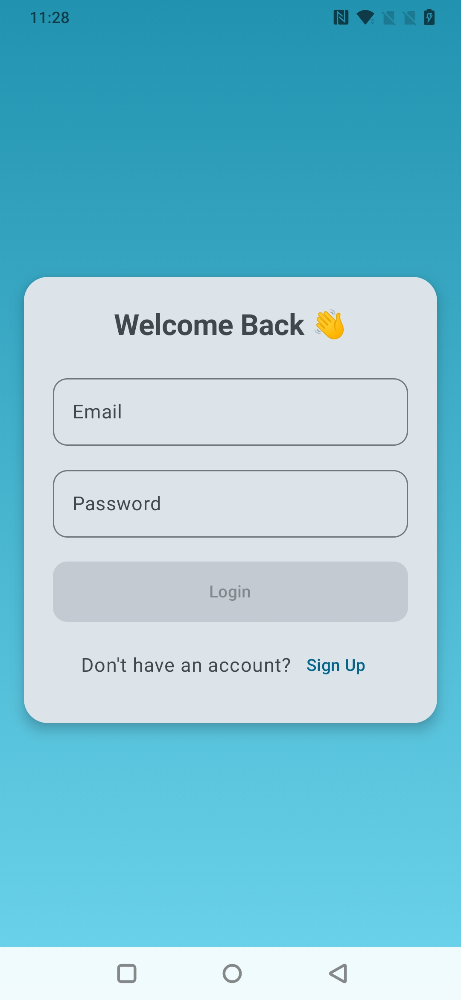
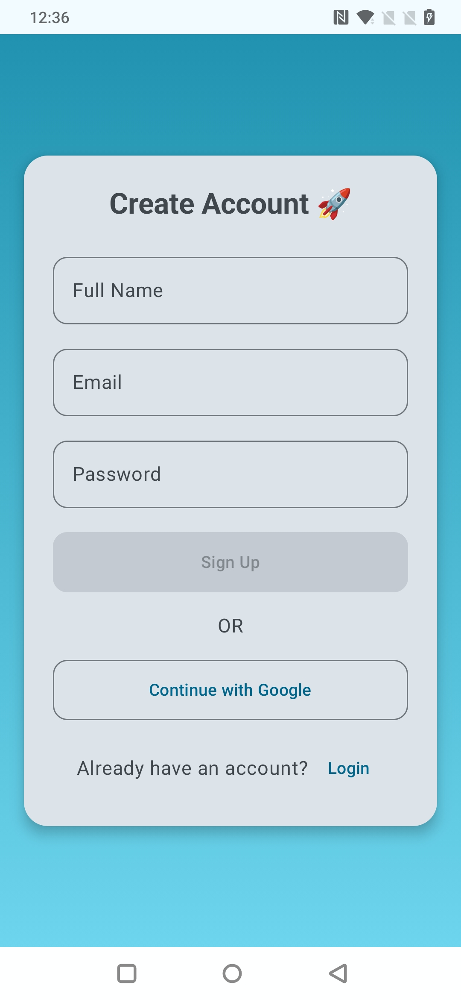
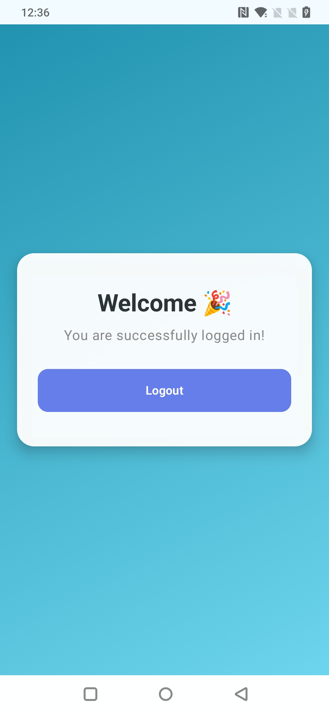

# Login & Signup Firebase Boilerplate 🚀

A ready-to-use Android Authentication Boilerplate built with Firebase Authentication.
This project helps developers quickly integrate Login & Signup functionality into their Android applications without setting up everything from scratch.

---

## ✨ Features

* 🔐 Firebase Authentication Integration
* 📱 User Login & Signup
* 🚪 Logout Functionality
* 🛡 Input Validation
* ⚡ Fast & Simple Setup
* 🎨 Clean UI Design
* 📂 Well-Structured Codebase
* 🔥 Ready for Production Use

---

## 🛠 Tech Stack

* Kotlin
* Android Studio
* Firebase Authentication
* Jetpack Components
* XML UI

---

## 📸 Screenshots

<p align="center">
  
  
  
</p>

## 🚀 Getting Started

### 1️⃣ Clone the Repository

```bash
git clone https://github.com/your-username/your-repository-name.git
```

---

### 2️⃣ Open in Android Studio

Open the project in Android Studio and let Gradle sync complete.

---

### 3️⃣ Connect Firebase

1. Go to [Firebase Console](https://console.firebase.google.com?utm_source=chatgpt.com)
2. Create a Firebase Project
3. Add an Android App
4. Download `google-services.json`
5. Place it inside:

```text
app/google-services.json
```

---

### 4️⃣ Enable Authentication

Inside Firebase Console:

* Open **Authentication**
* Go to **Sign-in Method**
* Enable:

  * Email/Password Authentication

---

### 5️⃣ Run the Project

Connect your Android device or emulator and click ▶ Run.

---

## 📂 Project Structure

```text
app/
├── java/
├── res/
├── AndroidManifest.xml
```

---

## 📌 Requirements

* Android Studio Hedgehog or newer
* Minimum SDK: 24+
* Kotlin Support

---

## 🤝 Contributing

Contributions are welcome.
Feel free to fork this repository and submit pull requests.

---

## 📄 License

This project is open-source and available under the MIT License.

---

## ⭐ Support

If you found this project useful, give it a ⭐ on GitHub.
